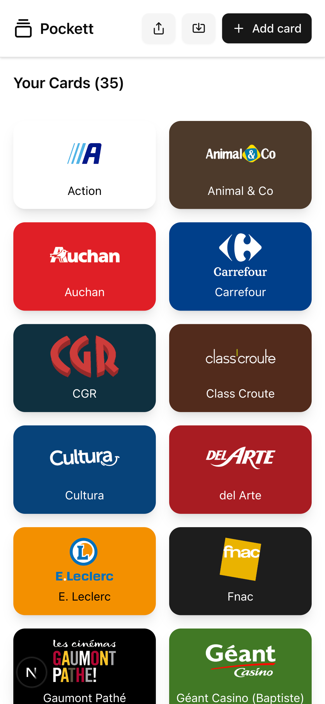
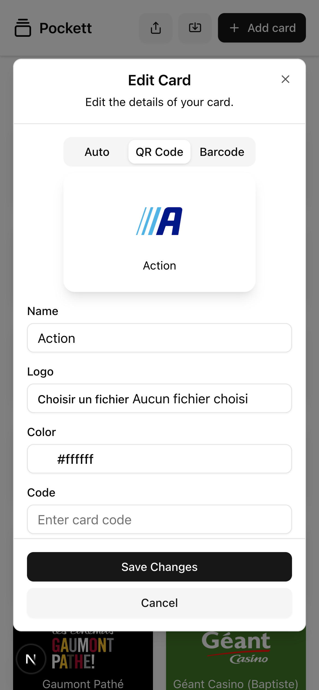

#  Placarr

[](https://nextjs.org/)
[](https://pnpm.io)
[](https://ui.shadcn.com/)
[](LICENSE)

**Placarr** is a sleek, mobile-first Next.js app that keeps all your inventory in your pocket.

---

## ✨ Features

- 📱 Responsive UI built with [shadcn/ui](https://ui.shadcn.com)

---

## 🚀 Getting Started

```bash
pnpm install
pnpm dev
```

Open [http://localhost:3000](http://localhost:3000) in your browser to view the app.

---

## 📸 Screenshots

<p align="center">
  
  
</p>

---

## 📚 Learn More

- [Next.js Documentation](https://nextjs.org/docs)
- [shadcn/ui Documentation](https://ui.shadcn.com)

---

## 📦 Deploy on Vercel

Deploy this project instantly with [Vercel](https://vercel.com/new?utm_source=create-next-app&utm_medium=readme):

[](https://vercel.com/new)

---

## 🧾 License

This project is licensed under the [MIT License](LICENSE).

---

Built with ❤️ using [Next.js](https://nextjs.org)
