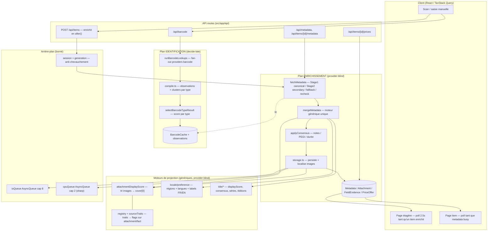

# Audit de fonctionnement — Placarr

> Audit réalisé le 2026-07-04 sur la branche `feat/foundation-postgres-tests`.
> Objectif : cartographier le fonctionnement réel, vérifier que le cœur est
> **provider-blind / data-driven / DRY / KISS**, et lister ce qui est **hors-piste**
> (code spécifique dans le core, dead code, duplications, boucles sans garde-fou).
>
> Ce document est descriptif **et** critique : la section « Cartographie » explique
> comment l'app marche ; la section « Constats » liste la dette, classée par priorité.

---

## 1. Vue d'ensemble

Placarr est une app Next.js (App Router, React 19, Prisma + **PostgreSQL**) de gestion
de collections physiques (jeux vidéo, films, musique, livres, jeux de société). On
scanne un code-barres ou on saisit un nom, l'app **identifie** le produit puis
**l'enrichit** (couvertures, description, facts, prix) en tâche de fond, à la Plex.

L'architecture repose sur **deux plans distincts et volontairement non fusionnés** :

| Plan | Rôle | Entrée | Racine code | Sortie |
|------|------|--------|-------------|--------|
| **Identification** (barcode) | « Ce code-barres = quel produit ? » decide-late | code-barres | `lib/barcode/**` + `services/barcode` | `BarcodeCache` (+ observations) |
| **Enrichissement** (metadata) | « Ce produit → couverture/desc/facts/prix » | nom + type + plateforme | `services/metadata/**` + `lib/metadata/**` | `Metadata` + `Attachment` + `FieldEvidence` + `PriceOffer` |

Les deux plans **produisent des observations typées** (jamais de « vérité » finale du
provider) et **projettent** ensuite un affichage via des moteurs génériques
(consensus, ranking d'images, ranking de titres). C'est le principe fondateur, et il
est **globalement bien tenu**.

### Le contrat provider-blind (et son garde-fou mécanique)

> Hors de `src/services/providers/`, **aucun fichier ne nomme un provider**. Le cœur
> découvre les providers via le registry et ne consomme que leurs traits déclarés.

- Point d'entrée unique : `PROVIDER_MODULES` dans
  [registry.ts](src/services/provider/registry.ts). Ajouter/retirer un provider = un
  objet module.
- Comportement piloté par **traits déclarés** (`isSecondary`, `rateLimited`,
  `canonicalCover`, `isRealBoxCover`, `digitalStorefrontArt`, `nameDatabase`,
  `coverProvenanceRules`, …), jamais par `if (providerId === "…")`.
- **Garde-fou mécanique** : [blindnessGuard.test.ts](src/services/provider/blindnessGuard.test.ts)
  scanne `src/` + `scripts/` et échoue le build sur tout literal de provider.
  **L'allowlist est vide (`{}`)** — l'invariant est donc réellement enforced, pas juste
  documenté. C'est un point fort remarquable du projet.

---

## 2. Cartographie du fonctionnement

### 2.1 Plan identification — `lib/barcode/**`

Le [resolver](src/services/barcode/resolver.ts) : cache-hit versionné
(`BARCODE_CACHE_VERSION`) → sinon fan-out `runBarcodeLookups` → `compileAllBarcodeTypeResults`
(un `CompiledResult` par type candidat) → `selectBarcodeTypeResult` (score par type,
signal board-game/vidéo) → persistance verbatim de `cleanName/displayName/edition` +
observations. Règle d'or encodée dans les tests : **vide honnête OK, faux positif
confiant interdit**. Les golden-masters (`resolver.test.ts` + fixtures) verrouillent ça.

### 2.2 Plan enrichissement — `services/metadata/**`

- **Un seul dispatcher** : `fetchByType.ts` route les 5 types vers `fetchMetadata`
  générique. Les vieux fetchers par type (`metadataGameFetch.ts`…) décrits dans
  `provider_agnostic_architecture.md` **n'existent plus** — la migration est faite.
- [fetch.ts](src/services/metadata/fetch.ts) : Stage 1 (canonical concurrents) →
  Stage 2 (secondary, gating par capability) → passe fallback (variantes de titre) →
  recheck → supplément édition. Tout est piloté par traits + `runWithConcurrency`
  (cap 5), abort-aware.
- [merge.ts](src/services/metadata/merge.ts) : **`mergeMetadata()` unique** pour tous
  les types. Titre = observations (rôle + locale → consensus médoïde → propreté) ;
  description = `pickBestLocalizedDescription` (FR > EN > plus long) ; images =
  `rankCoverGalleryAttachments` ; facts = consensus. Zéro nom de provider.
- [storage.ts](src/services/metadata/storage.ts) (1511 lignes) : persiste, **localise**
  les images distantes vers `/uploads`, calcule les métriques `sharp` une fois, dérive
  la `coverProvenance` **avant** localisation, réordonne cover-first, calcule
  `heroImageUrl`.

### 2.3 Les 5 logiques uniques (vérification)

Chacune des logiques « qui doivent être uniques » demandées existe et est **centralisée
et provider-blind** :

| Logique | Foyer unique | État |
|---------|-------------|------|
| **Tri images → cover par défaut = 1er** | [attachmentDisplayScore.ts](src/lib/media/attachmentDisplayScore.ts) `rankCoverGalleryAttachments` → `pickBestCoverFromAttachments = ranked[0]` | ✅ unique, ordre : type → mismatch plateforme → région → provenance → score → résolution |
| **Classification métadonnées par régions** | [locale/preference.ts](src/lib/locale/preference.ts) `LOCALE_REGION_ALIASES` + `regionRank` (FR > EU > WOR > …) | ✅ data-driven, ordre inversé selon la locale UI |
| **Consensualisation des facts** | [metadata/consensus.ts](src/lib/metadata/consensus.ts) (note médiane, PEGI mode, durée union) + `evidence/ranking.ts` | ✅ fonctions pures, une seule formule de confiance |
| **Titres/descriptions localisés FR/EN** | `locale/preference.ts` `inferTextLanguage` + `pickBestLocalizedDescription` + `title/displayScore` | ✅ on récupère tout, on labellise, on projette selon la locale |
| **Traits provider → flags client-safe** | [registry.ts](src/services/provider/registry.ts) + [sourceTraits.ts](src/services/provider/sourceTraits.ts) `withProviderAttachmentTraits` | ✅ le scorer client ne connaît pas le registry |

**Conclusion de la cartographie** : le cœur *est* déjà agnostique, generic et data-driven
sur l'essentiel. Les moteurs uniques existent. Ce n'est pas un chantier de refonte, mais
un chantier de **nettoyage de dette résiduelle**.

---

## 3. Constats — ce qui est hors-piste

Classé par priorité (impact × effort). Rien de bloquant ; ce sont des écarts au standard
que le projet s'est lui-même fixé.

### 🔴 P1 — Dead code (nettoyage sûr, gain de lisibilité immédiat)

L'intuition « on a beaucoup de fichiers, tout n'est pas utilisé » est **fondée**. Détection
par analyse d'imports (alias + relatifs + barrels) :

| Élément | Chemin | Preuve |
|---------|--------|--------|
| Composant mort | [ItemCarousel.tsx](src/components/ItemCarousel.tsx) | 0 référence |
| Composant mort | [ShelfBadge.tsx](src/components/ShelfBadge.tsx) | 0 référence |
| Modale morte | [BulkSeriesModal.tsx](src/components/modals/BulkSeriesModal.tsx) | 0 référence (le form `BulkSeriesForm` est utilisé, pas la modale) |
| Client API mort | [lib/api/user.ts](src/lib/api/user.ts) | 0 référence |
| **16 barrels `index.ts` jamais importés en dossier** | `lib/{core,item,title,jobs,db,http,pricing,provider,retailer,routing,text,games,dev}`, `services/{app,pricing,provider}` | le code importe toujours les chemins concrets (`@/lib/title/displayScore`), jamais `@/lib/title` — vérifié : 0 import-dossier |
| 2 fonctions `@deprecated` | `markItemMetadataRefreshStarted`, `clearItemMetadataRefreshStarted` dans [scheduleMetadataRefresh.ts](src/lib/jobs/scheduleMetadataRefresh.ts) | utilisées uniquement par leur propre test |
| Primitives UI shadcn probablement inutilisées | `ui/{alert-dialog,breadcrumb,pagination,popover,scroll-area,separator,table}.tsx` | 0 import applicatif (à confirmer au cas par cas) |

**Action** : supprimer les composants/clients morts + les barrels non importés (les
fichiers cibles restent, seul le `index.ts` de re-export part). Retirer les 2 fonctions
deprecated et leur test. Gain : ~25 fichiers en moins, arbre plus lisible, moins de
« quel est le vrai point d'entrée ? ».

> **✅ Exécuté le 2026-07-04.** 27 fichiers supprimés (3 composants, `lib/api/user`,
> 16 barrels, 7 primitives UI) + 2 fonctions `@deprecated` et leur cas de test.
> Au passage, le build de la branche était **déjà rouge** avant le nettoyage : 3 erreurs
> de type préexistantes, sans lien avec le dead code, ont été corrigées pour rétablir le
> build vert (`attachmentDisplayScore` : trait `isGameMediaGallerySource` absent du type ;
> `coverPlaceholder.server` : namespace `sharp` ; `metadataPriceFallback` : champs manquants
> de `BarcodePricesResult`). Build ✅ · 1552 tests ✅ · lint ✅.

### 🟠 P2 — Literals spécifiques résiduels dans le core

Le guard attrape les **ids de provider**, mais pas les **noms de sources/produits
hardcodés** qui ne correspondent à aucun module. Il en reste :

1. **Word-list musique + préfixes barcode dupliqués** dans
   [resolver.ts](src/services/barcode/resolver.ts) `selectBarcodeTypeResult` :
   - `/^(0?(498|499)|45|88)/` (préfixes « audio-like ») écrit **deux fois** (L218 et L252) → DRY.
   - `/\b(?:orchestra|soundtrack|ost|album|cd)\b/i` → **liste magique de mots** dans le
     core, exactement ce que `placarr-principles.mdc` interdit. La désambiguïsation
     musique devrait venir d'un signal (comme `detectBoardGameSpecialistSignal` le fait
     déjà pour les jeux de société via le registry), pas d'un regex de mots.

   > **✅ Exécuté le 2026-07-04.** Le préfixe dupliqué est extrait dans une const
   > (`AUDIO_LIKE_BARCODE_PREFIX`). La word-list musique est **supprimée** et remplacée
   > par un signal registry : `detectSpecialistSignal` (helper généralisé, partagé avec
   > les jeux de société) alimente `scoreTypeCandidate` via
   > `TYPE_SCORE.musicSpecialistSignal` — un provider mono-type musique (Discogs /
   > MusicBrainz / Deezer) anchoré promeut `musics` et pénalise `games`. Test unitaire
   > ajouté (`compile.typeSelection.test.ts`), `BARCODE_CACHE_VERSION` bumpé v41→v42.
   > 1555 tests ✅ · build ✅. Reste à réconcilier les 2 définitions divergentes de
   > préfixe audio (`AUDIO_LIKE_BARCODE_PREFIX` vs `scoring.AUDIO_BARCODE_PREFIX`) et à
   > câbler `detectVideoGameSignal`, défini mais non passé par le resolver.

   La **dedup #2** (`steamdb`/`pcgamingwiki`) est faite (repliée sur le set) ; le label
   `"BGG (Bayes)"` et les **sous-titres produit #3** restent (voir ci-dessous).

2. **Sources fantômes hardcodées** dans
   [sourceTraits.ts](src/services/provider/sourceTraits.ts) :
   `PC_SPECIFIC_FACT_SOURCE_KEYS = ["steamdb","pcgamingwiki"]` (L66), **redupliqué** en dur
   L354-355, et le label `"BGG (Bayes)"` (L68). Ce sont des noms de sources sans module
   provider — donc invisibles au guard, mais bien du spécifique dans le core.

3. **Sous-titres produit déguisés en « dictionnaire »** dans
   [tokenEquivalents.ts](src/lib/title/tokenEquivalents.ts) `TITLE_PHRASE_EQUIVALENT_GROUPS` :
   `"birth of a new world"`, `"the american saga"`, `"movie video game"`. La règle écrite
   en tête du fichier (« jamais le sous-titre ou le nom d'un produit précis ») est violée
   par ces entrées. `word_list_audit.md` les marque « FIXED 2026-07-02 » — c'est
   **inexact** : ce ne sont pas des mots de dictionnaire, ce sont des équivalences par
   produit qui devraient venir des `regionalTitles`/aliases des providers.

4. **Couplage de nommage** : `BGG_LANGUAGE_ROLE_MAP` / `mapBggLanguageToAttachmentRole`
   dans [locale/preference.ts](src/lib/locale/preference.ts). La *logique* est générique
   (langue → région), mais le *nom* porte un provider dans le core. Renommer en
   `LANGUAGE_NAME_TO_REGION` / `mapLanguageNameToAttachmentRole`.

### 🟡 P3 — Config centralisée vs auto-déclaration (tension d'architecture)

[registry.ts](src/services/provider/registry.ts) contient `PROVIDER_METADATA_EXTENSIONS`,
une **grande map keyée par provider id** (`screenscraper: {...}`, `chocobonplan: {...}`,
`geedie: {...}`, `chipweld`, `netgamesretro`…). Le code lit `mdl.info.X ?? ext.X`, donc
les modules **peuvent** déjà s'auto-déclarer — mais beaucoup de traits vivent encore dans
cette map centrale. Conséquence concrète : pour les retailers PrestaShop, certains traits
sont dans `prestashop/configs.ts` et d'autres dans la map du registry → **deux endroits
pour décrire un même provider**. Ce n'est pas un leak (le principe autorise la config
déclarative), mais c'est une migration à moitié faite qui brouille « le module se déclare
lui-même ». **Action** : pousser ces extensions dans le `info` de chaque module (ou dans
`configs.ts` pour les retailers), et supprimer la map.

### 🟢 P4 — KISS / complexité (surveiller, pas urgent)

- [fetch.ts](src/services/metadata/fetch.ts) : le moteur est générique mais **saturé de
  branches `type === "games"`** (gallery, plateforme, édition, web-only console). C'est de
  la spécificité *par type de média* (légitime) mais la densité rend le fichier difficile.
  Piste : extraire une stratégie « games » (hooks de gating) pour que `fetchMetadata` reste
  lisible, sans re-créer un fetcher par type.
- [storage.ts](src/services/metadata/storage.ts) à 1511 lignes fait persistance +
  localisation d'images + métriques + hero + provenance. Découpable en modules cohérents
  (persistImages / persistFacts / persistPrices) sans changer le comportement.

### 🔵 P5 — Boucles / garde-fous (globalement sain, une exception)

Bonne nouvelle : **pas de boucle sans garde-fou côté serveur**. Les pools sont bornés
(`ioQueue` cap 8, `cpuQueue` cap 2), les refresh sont sérialisés par session+génération
(anti-chevauchement), le retry HTTP est borné (5 essais, backoff exp, abort-aware), et les
polls client s'arrêtent sur borne temporelle ([enrichment.ts](src/lib/item/enrichment.ts) :
enrich 3 min, refresh 15 min, grâce orphelin 2 min). C'est du bon travail.

**Seule exception** : [BackgroundJobsMenu.tsx](src/components/BackgroundJobsMenu.tsx) poll
en permanence (2.5s si jobs actifs, **10s au repos, sans jamais s'arrêter**) pour tout
utilisateur connecté. Ce n'est pas une fuite, mais un trafic de fond permanent évitable.
Piste : `refetchInterval: false` au repos + invalidation événementielle après mutation.

### ⚪ P6 — Résidus de migration (hygiène dépôt)

Migration SQLite → Postgres faite dans `schema.prisma`, mais restent sur disque :
`prisma/dev.db` (18 Mo) + backup + `prisma/data-export.json` (6 Mo) + `shelves-seed.json`
(4.4 Mo) + `scratch/` (~30 scripts one-off). Tous gitignorés → pas dans le dépôt, mais à
purger localement. **Ne pas toucher** : `node:sqlite` dans `icollect/launchbox/indexStore`
est **légitime** — ce sont des index locaux read-only encapsulés dans les providers, pas la
DB applicative.

---

## 4. Recommandations (ordre suggéré)

1. **P1 dead code** — suppression sûre, gros gain de lisibilité, zéro risque
   (couvert par la compilation + tests). À faire en premier.
2. **P2.1 & P2.2** — remplacer la word-list musique par un signal registry-driven
   (miroir de `detectBoardGameSpecialistSignal`) ; dédupliquer le regex de préfixes ;
   sortir `steamdb/pcgamingwiki`. Ajouter au besoin les termes au guard pour verrouiller.
3. **P2.3** — vider `TITLE_PHRASE_EQUIVALENT_GROUPS` des sous-titres produit et corriger
   la ligne « FIXED » de `word_list_audit.md` (encoder un test de non-régression).
4. **P3** — replier `PROVIDER_METADATA_EXTENSIONS` dans les modules/configs (une source
   de vérité par provider).
5. **P4** — refactor `fetch.ts` (stratégie games) et `storage.ts` (découpe) quand une
   évolution le justifie.
6. **P5/P6** — poll idle du menu jobs + purge des résidus de migration.

> **Message clé** : Placarr *tient déjà* son principe provider-blind (guard à allowlist
> vide, moteurs de projection uniques et génériques). Le travail restant n'est pas
> « rendre le core agnostique » — il l'est — mais **retirer la dette résiduelle** (dead
> code, quelques listes magiques, config à moitié migrée) pour que l'intention et le code
> coïncident à 100 %.
