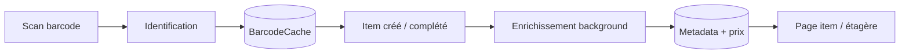

# Cartographie codebase — où aller quand…

> Complète [audit_fonctionnement.md](audit_fonctionnement.md) (audit 2026-07-04).
> Dernière mise à jour : **2026-07-05** (split `registry.ts` / `catalog.ts`).

## Taille réelle (hors UI)

| Zone | Fichiers `.ts` | Dont tests | Rôle |
|------|----------------|------------|------|
| `services/providers/` | ~204 | ~40 | **Plugins** — un dossier = un provider |
| `services/` (hors providers) | ~68 | ~32 | **Orchestration** I/O (fetch, merge, persist, barcode resolve) |
| `lib/` | ~279 | ~113 | **Logique pure** (score, compile, titre, images, policy) |
| `components/` + `app/` | ~108 | — | UI + routes API |

**Le cœur métier ≈ 270 fichiers non-test** (lib + services hors providers). Ce n’est pas aberrant pour une app multi-types avec barcode + enrichissement + prix — mais la **frontière lib/services** est peu intuitive.

---

## Deux plans (ne jamais les fusionner)

| Plan | Question | Entrée utilisateur | Dossiers | Persistance |
|------|----------|-------------------|----------|-------------|
| **Identification** | « Ce barcode = quoi ? » | Scan sans type | `lib/barcode/**`, `services/barcode/` | `BarcodeCache` |
| **Enrichissement** | « Ce produit → metadata + prix » | Item / refresh | `services/metadata/**`, `lib/metadata/**` (helpers) | `Metadata`, `PriceOffer` |



---

## Règle `lib/` vs `services/` (aujourd’hui)

| Mettre dans… | Quand… | Exemples |
|--------------|--------|----------|
| **`lib/`** | Fonction **pure**, pas d’I/O réseau/DB, testable sans mock | `compile.ts`, `platformPick.ts`, `titleMatching.ts`, `cachePolicy.ts` |
| **`services/`** | **Orchestration** : appels providers, Prisma, fichiers, `after()` jobs | `fetch.ts`, `storage.ts`, `resolver.ts`, `merge.ts` |
| **`services/providers/`** | Tout ce qui connaît **une source externe** | `screenscraper/`, `prestashop/` |
| **`services/provider/`** | **Registry** + bootstrap providers (pas les providers eux-mêmes) | `registry.ts`, `catalog.ts`, `bootstrap.ts` |

**Piège fréquent** : le même mot (`barcode`, `metadata`, `pricing`) existe dans `lib/` **et** `services/` — ce n’est pas un doublon, c’est **moteur** vs **pipeline**.

---

## Où aller selon le bug / la feature

### Scan & type produit

| Symptôme | Aller voir |
|----------|------------|
| Mauvais type (jeu vs musique vs livre) | `lib/barcode/evidence/compile.ts`, `scoring.ts`, `services/barcode/resolver.ts` |
| Mauvaise plateforme (PS2 vs PS3…) | `lib/barcode/platformPick.ts`, `lib/games/platforms.ts` |
| Faux positif confiant / vide honnête | `compile.confidenceLock.test.ts`, `compile.honestEmpty.test.ts` |
| Titre barcode incorrect | `lib/barcode/evidence/consensusTitle.ts`, `lib/barcode/titleUtils.ts` |
| Cache barcode stale | `lib/barcode/lookup/cachePayload.ts`, version cache dans `compile.ts` |

### Metadata & couvertures

| Symptôme | Aller voir |
|----------|------------|
| Refresh metadata ne part pas / bloqué | `lib/jobs/backgroundWorkQueue.ts`, `lib/item/enrichment.ts` |
| Provider pas appelé au enrich | `services/metadata/metadataFetchGating.ts`, `fetch.ts` |
| Mauvaise cover affichée | `services/metadata/merge.ts`, `mergeObservationRanking.ts`, `lib/item/media.ts` |
| Merge titre / région | `lib/metadata/displayScore.ts`, `lib/locale/preference.ts` |
| Facts dupliqués (durée IGDB…) | `services/metadata/facts/*`, `normalizeMetadataFacts` |
| Observations manquantes | `services/provider/bootstrap.ts` (`withProviderObservations`) |

### Prix

| Symptôme | Aller voir |
|----------|------------|
| Prix absents / cache | `services/pricing/resolver.ts`, `lib/pricing/cachePolicy.ts` |
| Mauvaise annonce (volume manga…) | `lib/pricing/metadataPriceFallback.ts`, listing filters |
| Refresh prix URL-first | `services/metadata/persistProviderExternalLinks.ts`, `lib/metadata/providerExternalLinks.ts` |

### Providers (plugin)

| Symptôme | Aller voir |
|----------|------------|
| Ajouter / retirer un provider | **`services/provider/registry.ts`** (manifeste seul) |
| Comportement d’un provider | `services/providers/<id>/` |
| Découverte types/capabilities | `services/provider/catalog.ts` |
| Audit mapping champs | `pnpm providers:audit:mapping`, `services/provider/mappingAudit.ts` |

### UI & API

| Symptôme | Aller voir |
|----------|------------|
| Modal ajout item | `components/modals/ItemModal.tsx`, hooks metadata react-query |
| Scan caméra | composants scan + `QuickScanModal` |
| Route API item/shelf | `src/app/api/items/**`, `src/app/api/shelves/**` |
| Admin providers | `src/app/api/admin/providers/route.ts`, `app/admin/page.tsx` |

---

## Arborescence `lib/` (mémo)

```
lib/
  barcode/     ← identification (evidence, compile, lookup, scoring)
  metadata/    ← helpers merge/display (observations, titres, platform)
  item/        ← modèle item côté client + enrichment polling
  media/       ← images, proxy, placeholder, cover scoring
  pricing/     ← policy cache, fallback prix metadata
  title/       ← séries, variantes recherche, tokenEquivalents
  locale/      ← préférences langue/région UI
  jobs/        ← file background (refresh, enrich)
  provider/    ← petits helpers partagés providers (health, priceOffers)
  games/       ← plateformes, slugs
  …            ← auth, db, http, dev (outils)
```

## Arborescence `services/` (hors providers)

```
services/
  barcode/     ← resolveBarcode (orchestrateur scan)
  metadata/    ← fetch, merge, storage, selection, gating
  pricing/     ← résolution prix item + affichage étagère
  provider/    ← registry (manifeste), catalog (découverte), bootstrap, barcode fan-out
  app/         ← glue app-level (si présent)
```

---

## Proposition de rangement « core » (phased — **pas fait**)

Objectif : **une entrée mentale**, pas fusionner les pipelines.

### Option A — Renommer / regrouper (faible risque)

```
src/
  core/                    ← alias documentaire (pas de gros move)
    identification/        ← symlink doc → lib/barcode + services/barcode
    enrichment/            ← services/metadata + lib/metadata helpers
    catalog/               ← services/provider (registry, catalog, bootstrap)
    pricing/               ← lib/pricing + services/pricing
  providers/               ← move services/providers → src/providers (cosmétique)
  app/ + components/       ← inchangé
```

### Option B — `src/core/` physique (moyen risque, 1 PR dédiée)

Déplacer **sans fusionner** :

| Actuel | Cible |
|--------|-------|
| `lib/barcode/**` | `core/identification/**` |
| `services/barcode/**` | `core/identification/pipeline/**` |
| `services/metadata/**` | `core/enrichment/**` |
| `lib/metadata/**` (helpers) | `core/enrichment/lib/**` |
| `services/provider/**` | `core/catalog/**` |
| `lib/pricing/**` + `services/pricing/**` | `core/pricing/**` |

Garder dans `lib/` : `auth`, `db`, `http`, `client`, `dev` (infra transverse).

**Ne pas fusionner** (principes Placarr) : pipelines barcode evidence vs compile ; fetch vs merge metadata.

### Option C — Réduire le *nombre* de fichiers (limité)

| Action | Gain | Risque |
|--------|------|--------|
| Supprimer barrels `index.ts` morts | faible | déjà fait (audit dead code) |
| Regrouper petits helpers même domaine | ~10–20 fichiers | lisibilité ↓ |
| Fusionner `lib/` + `services/` par domaine | confusion ↓ | imports massifs, PR énorme |
| Supprimer tests | compte ↓ | **interdit** |

La vraie réduction vient surtout de **moins de dossiers à comprendre**, pas de moins de fichiers.

---

## Checklist « j’ajoute un provider »

1. `services/providers/<id>/` — module complet
2. **Une ligne** dans `services/provider/registry.ts`
3. `pnpm test` + `pnpm providers:audit:mapping`
4. **Rien d’autre** (pas de test avec liste d’ids hardcodée — utiliser `PROVIDER_MODULES`)

---

## Prochaines actions suggérées

1. **Court terme** : utiliser ce doc + `audit_fonctionnement.md` comme carte (déjà suffisant pour naviguer).
2. **Moyen terme** : PR « rename only » → `src/core/` avec re-exports `@/core/...` pour compat imports.
3. **Long terme** : diagramme par **feature produit** dans le README dev (scan, shelf, loan, explore).

Ne pas lancer un big-bang merge avant d’avoir une **carte stable** — c’est ce document.
