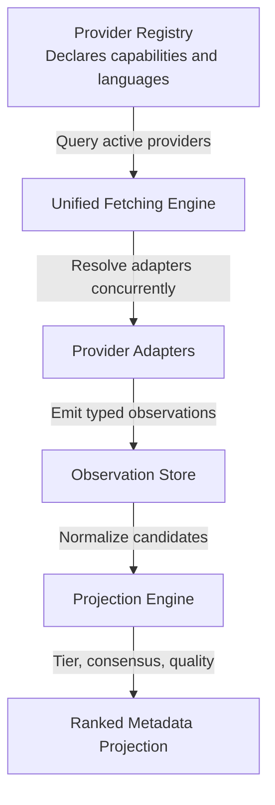

# Provider-Agnostic, Capability-Driven Metadata Engine

This document presents the findings of our codebase audit regarding provider-specific hardcoding and proposes a clean, generalized, and fully plug-and-play architecture for metadata fetching and merging.

> **Note — field ranking superseded.** This document still selects fields by a
> per-provider `weight` (e.g. "choose the date from the provider with the highest
> weight"). That per-provider weighting is now considered a bias to remove. Field
> ranking is governed by [unbiased_ranking.md](unbiased_ranking.md): rank by
> factual *observation* properties (source-document role, field role, locale,
> evidence signals) + cross-source consensus, never by which provider supplied the
> datum. `canonicalTitle` / display cover / final facts are projections computed by
> Placarr, not provider promises. The fetching/merging *plumbing* below
> (capability-driven, type-addressed, plug-and-play) still stands.

> **Adding a provider?** Follow the step-by-step
> [provider_integration_checklist.md](provider_integration_checklist.md) — it
> ensures the provider is fully exploited (never under-used), tested, and verified
> against the live source.

---

## 0. Core invariant — the app is provider-blind

> Outside `src/services/providers/`, **no code may name a specific provider.** The
> app is not aware of which providers exist; it discovers them only through the
> registry, and consumes only their **self-declared** data.

The contract:

- **Single entry point**: `PROVIDER_MODULES` in `providerRegistry.ts`. Adding or
  removing a provider = adding/removing **one module object**. Nothing else changes.
- **The module self-declares everything** the app needs: `info` (id, label,
  `types`, `capabilities`, `auth`, and its **`baseUrl`/site**), default language,
  plus its own fetch/resolve/health/probe logic. Fine-grained trust is emitted per
  observation, not as a global provider privilege.
- **The core consumes only abstract contracts**: `ProviderInfo`, `MetadataResult`,
  `MetadataAttachment` (role + language), `MetadataFact`, `capabilities`. It
  iterates via `providersForType` / `capabilityCoverage` — **never** a branch on a
  concrete id.
- **Per-provider behaviour = a declared property, not a name.** "I provide real box
  covers" → an `isRealBoxCover` capability, not a hardcoded `Set` of provider names.
- **Providers emit typed observations, not final truth.** A single provider may
  expose a clean product fiche, noisy marketplace listings, structured facts,
  provider-grouped aliases, cover art, user/vendor photos, and offers. Each value
  must carry source-document role, field role, language/region when relevant, and
  evidence signals (barcode match, external id, structured data, title match, ...).
- **Never throw useful observations away.** The current ranking output is a
  projection over stored observations. Weak marketplace/user observations can rank
  low or be excluded from public search, but they remain available for audit,
  debugging, and future ranking-engine reprojection.
- **Scope = everything except `src/services/providers/`** — the **core *and* the
  admin**. A connector may hardcode what is specific to *its own* API/format
  (legitimate, encapsulated); the rest of the app may not.

### Current violations (the gap between intent and code)

**Core engine:**

| File | Leak |
| --- | --- |
| `services/metadataFetch.ts` | dedicated `get/set("screenscraper")` stage; `=== "screenscraper" ? 6 : 12`; hardcoded list `["igdb","thegamesdb","launchbox","rawg"]`; `=== "pricecharting"` ×3 |
| `lib/attachmentDisplayScore.ts` | `REAL_BOX_COVER_SOURCES` name set; `=== "coverproject"` ×2 |
| `services/metadataMerge.ts` | `=== "steam"` ×2, `=== "discogs"` |
| `services/metadataStorage.ts` | `source === "discogs"` ×2 (covers) |
| `lib/barcode/cachePayload.ts` | `url.includes("screenscraper")` |
| `lib/metadataDiscogs.ts` | Discogs-specific logic leaked into `lib/` |
| type-specific fetchers (`metadataGameFetch.ts`, …) | name providers (`gameProviderOrder`, `let ss =`, …) — see §1 |
| `services/metadataDatabase.ts` `confrontWithDatabase` | `switch(type)` calling a named provider per type (IGDB/TMDB/BGG/…) |

**Admin:**

| File | Leak |
| --- | --- |
| `app/api/admin/product-teardown/route.ts` | replicates the noise dictionaries (conditions / regions / "jeu video") — content hardcode **and** duplication of `titleUtils` |
| `app/api/admin/test-provider/route.ts` | `handler.kind === "scandex"` branch instead of driving `testHandlers` generically |
| `app/api/admin/metadata-enrich/route.ts` | `source: "screenscraper"` hardcoded |
| `app/api/admin/providers/route.ts` | `TYPES` / `CAPABILITIES` listed by hand instead of derived from the type system / registry union |

(`admin/providers/route.ts` otherwise correctly iterates `PROVIDERS` — the model to follow everywhere.)

### Enforcement — make the invariant mechanical

A **guard test** scans every file outside `src/services/providers/` and **fails the
build** on a provider-id literal (`"screenscraper"`, `providerId === …`) or a
hardcoded provider-name set / noise list. The violations above are seeded as a
**shrinking allowlist**; each cleanup removes one entry; new leaks fail immediately.
This turns the agreement into an invariant, not a hope.

---

## 1. Audit Findings: Provider-Specific Hardcoding

Our audit identified several areas where specific metadata providers (such as `screenscraper`, `igdb`, `launchbox`, `musicbrainz`, etc.) are hardcoded and treated as special cases in the core engine.

### A. Fetching Orchestration (High Specificity)
The application has 5 media-type-specific fetchers:
- `metadataGameFetch.ts`
- `metadataMovieFetch.ts`
- `metadataMusicFetch.ts`
- `metadataBookFetch.ts`
- `metadataBoardGameFetch.ts`

Each of these files:
- Hardcodes a specific list of providers (`gameProviderOrder`, `musicProviderOrder`, etc.).
- Resolves results into specific local variables (e.g. `let ss = ...`, `let igdb = ...`).
- Triggers custom fallback query logic targeting specific providers by name (e.g., checking if `!ss` to run a Screenscraper fallback, or if `!tgdb` to run a TheGamesDB fallback).
- Manually maps hardcoded provider names when generating `fieldEvidence`.

### B. Merge Operations (High Specificity)
In `metadataMerge.ts`, there are 5 type-specific merge functions (e.g., `mergeGameMetadata`, `mergeBookMetadata`).
These functions:
- Receive a fixed list of provider results as positional arguments.
- Select fields like `releaseDate` or `description` using hardcoded priority rules:
  ```typescript
  const releaseDate = igdb?.releaseDate || ss?.releaseDate || tgdb?.releaseDate || ...
  ```
- Map specific languages to hardcoded providers when filtering descriptions:
  ```typescript
  { text: ss?.description, language: "fr", source: "screenscraper" }
  ```
- Map specific attachments by source name:
  ```typescript
  const screenscraperAttachments = (ss?.attachments || []).map(a => ({ ...a, source: "screenscraper" }))
  ```

### C. Attachment Ranking (Medium Specificity)
In `attachmentDisplayScore.ts`, provider names are hardcoded to identify real retail box cover scans:
```typescript
const REAL_BOX_COVER_SOURCES = new Set([
  "bgg",
  "boardgamegeek",
  "screenscraper",
  "thegamesdb",
  "coverproject"
]);
```

---

## 2. Proposed Architecture: Generalized Capability-Driven Engine

To make all providers 100% plug-and-play and remove all hardcoded references from the core engine, we propose the following architecture:



### 1. Enriching the Provider Registry (`providerRegistry.ts`)
Each provider will announce its factual metadata attributes and supported item types in the registry:
- **`types`**: The item types managed by this provider (e.g., `["games"]`, `["books"]`, `["movies"]`), allowing the engine to dynamically filter active providers based on the media type requested.
- **`capabilities`**: The specific metadata fields and data types this provider can supply (e.g., `"price"` for pricing data, `"rating"` for user reviews, `"duration"` for play-time/difficulty, `"cover"`, `"description"`). The engine uses these declarations to only query the subset of providers capable of supplying the requested data fields.
- **`defaultLanguage`**: The primary language of its returned text (e.g. `"fr"` for ScreenScraper, `"en"` for OMDb).
- **source/field roles on observations**: a provider declares what each returned
  value is (`object_title`, `listing_title`, `cover_front`, `listing_photo`,
  `structured_fact`, `offer`, ...). The registry says what can be queried; the
  observation says what was actually found.

### 2. A Unified Fetching Engine (`metadataFetch.ts`)
Instead of 5 separate fetchers, a single generic fetcher will handle all media types:
1. Query the registry to find all enabled providers that support the requested `MediaType`.
2. Resolve them concurrently using the registered adapters.
3. Store their raw/normalized observations with provenance.
4. Run generic fallbacks only from abstract evidence (external ids, strong object
   titles, platform/type signals), never from a named provider.

### 3. A Unified Merge Engine (`metadataMerge.ts`)
Instead of type-specific merge functions, a single `mergeMetadata()` function will merge an array of `MetadataResult` objects:

- **Title**: Select the projected display/canonical title by comparing typed title
  observations: object/catalog title + locale first, then medoid consensus, then
  cleanliness. Listing/user titles remain evidence even when they lose display.
- **Description**: Collect descriptions, tag them with their provider's `defaultLanguage` or use `inferTextLanguage()`, and sort them using the existing `pickBestLocalizedDescription()` (preferring French, then English, then longest text).
- **Release Date**: Choose the best typed date observation by source role,
  consensus and specificity.
- **People / Publishers**: Deduplicate and union all authors/publishers.
- **Attachments**: Merge and rank all attachments dynamically. Product covers /
  box-fronts rank above listing/user photos, but weak photos are retained as
  observations.
- **Facts & Aliases**: Merge and deduplicate dynamically.
- **Field Evidence**: Automatically generate evidence tags from observation
  provenance, source-document role and evidence signals.
- **External IDs**: Merge all external IDs returned by providers. If two providers
  return different values for the same identifier type (e.g., IMDb ID), resolve by
  confirmation evidence (same barcode, same object id family, cross-source
  agreement), not provider weight.
- **Propagation between Stages**: Collect strong external-id observations and pass
  them down as an `externalIds` dictionary in `MetadataAdapterContext` to
  subsequent providers (Stage 2 and fallbacks), enabling cross-provider identifier
  propagation (e.g., retrieving Steam/RAWG metadata using an IGDB ID resolved in
  Stage 1) without hardcoding.

### 4. A Common API Contract & Modular Connectors
To allow dropping in new providers or removing old ones easily during the app lifecycle:
- **Parameter-less Adapter Instantiation**: Eliminate the circular dependency pattern where resolvers are instantiated globally and injected back into adapters via `deps` objects. The `createMetadataAdapter` contract will be parameter-less:
  ```typescript
  export interface ProviderModule {
    info: ProviderInfo;
    evidence?: ProviderEvidenceConfig;
    createMetadataAdapter?: () => MetadataProviderAdapter | null;
    // ...
  }
  ```
  Each connector module imports and executes its own client/resolver locally. Adding or removing a provider is as simple as adding or removing its module object in the `PROVIDER_MODULES` array in `providerRegistry.ts`.

---

## 3. TDD-Driven Refactoring Workflow

To guarantee system stability, the entire migration must follow a strict **Test-Driven Development (TDD)** and test-guided refactoring process.

### Step 1: TDD for Generic Merging
Before writing any code for the generic merge engine, we write new tests in `metadataMerge.test.ts`:
- **Test 1**: Verify title selection chooses the best projected title from typed
  observations: role + locale, then medoid consensus, then quality.
- **Test 2**: Verify description selection correctly tags and sorts French/English descriptions from unknown/non-tagged ones.
- **Test 3**: Verify attachments are correctly ranked according to provider attributes.
- **Test 4**: Verify publishers, authors, facts, and aliases are correctly deduplicated and combined.
Once the tests are written and failing, we implement `mergeMetadata()` in `metadataMerge.ts` until all tests pass.

### Step 2: TDD for Generic Fetching
We write unit tests in `metadataFetch.test.ts` for the new `fetchMetadata()` engine using mock provider modules:
- Test fetching by media type (filtering out irrelevant providers).
- Test fetching with capabilities (filtering only providers declaring those capabilities).
- Test fallback querying (ensuring that when a primary search fails, fallback titles are searched sequentially).
We then implement the generic fetching engine in `metadataFetch.ts`.

### Step 3: Incremental Media-Type Migration
We migrate each media type fetcher one by one:
1. **Books**: 
   - Verify existing tests in `metadataBookFetch.test.ts` are passing.
   - Refactor `metadataBookFetch.ts` to call the generic fetching and merging engine.
   - Verify tests in `metadataBookFetch.test.ts` still pass.
2. **Movies**:
   - Verify existing tests in `metadataMovieFetch.test.ts` are passing.
   - Refactor to the generic engine and verify tests pass.
3. **Music**:
   - Verify existing tests in `metadataMusicFetch.test.ts` pass, refactor, and verify they still pass.
4. **Board Games**:
   - Verify existing tests in `metadataBoardGameFetch.test.ts` pass, refactor, and verify they still pass.
5. **Games**:
   - Verify existing tests in `metadataGameFetch.test.ts` pass, refactor, and verify they still pass.

---

## 4. Step-by-Step Refactoring Plan

We can execute this refactoring in phases without breaking existing tests:

### Phase 1: Enrich Provider Contracts
- Add discriminated observation/candidate types for titles, images, facts, aliases
  and offers, with required provenance and role fields.
- Update provider modules to emit those roles instead of relying on global
  `weight`, `canonical`, `trustedRetailer` or `isRealBoxCover` privilege.
- Update `attachmentDisplayScore.ts` and title ranking to consume observation
  roles and consensus, not provider-name sets.

### Phase 2: Implement Generic Merging
- Write the generic `mergeMetadata()` function in `metadataMerge.ts`.
- Write unit tests in `metadataMerge.test.ts` to verify it matches the current merging outcomes for all media types.

### Phase 3: Implement Generic Fetching
- Write the generic fetching orchestrator in `metadataFetch.ts`.
- Replace the type-specific fetch files (`metadataGameFetch.ts`, etc.) with calls to the generic fetcher.
- Verify all tests pass.
- Delete the obsolete type-specific fetch and merge files.

---

## 5. Extensibility: Adding a New Media Type

With this capability-driven, generic design, adding support for a new item type (for example, `"comics"` or `"toys"`) in the future is extremely simple and requires zero changes to the core metadata engine:

1. **Database Schema**: Add the new type to the `Type` enum in `prisma/schema.prisma`.
2. **Type Definition**: Add the new string type to the `MediaType` type in `src/types/providerRegistry.ts`.
3. **Register Providers**: Create or update provider connectors for the new type, and declare `types: ["comics"]` in their `info` object in `providerRegistry.ts`.
4. **Done**: The generic `fetchMetadata` and `mergeMetadata` engines will automatically resolve, fetch, rank, and merge the metadata for the new media type without requiring any new orchestrator or merge code.
