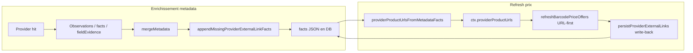

# External links & price-refresh URL reuse

> Session **2026-07-05** — politique produit pour tracer chaque hit provider et
> éviter les double-seeks au refresh prix. Tests : `providerExternalLinks.test.ts`,
> `persistProviderExternalLinks.test.ts`, `providerProductUrls.test.ts`, plus les
> resolver/gate tests retailers existants.

---

## Problème

Quand un provider contribue metadata, facts, observations ou prix, l’URL produit
utile était souvent perdue (restée dans une observation, un `source-url`, ou le
`sourceUrl` d’une offer). Conséquences :

1. **Sources & boutiques** (`ProviderLinksBar`) incomplète — impossible de voir
   d’où vient une fiche erronée (covers IGDB, prix Lorcast, faits LorcanaJSON…).
2. **Refresh prix** re-seekait barcode/titre alors qu’on avait déjà la fiche
   produit (`chasseauxlivres`, `okkazeo`, PrestaShop, Philibert, …).

---

## Invariant produit

> **Chaque provider registry qui a contribué (fact / evidence / cover / prix)
> apparaît dans Sources & boutiques.** Préférer une URL fiche produit ; sinon
> le `websiteUrl` du registry (attribution). Jamais d’URL inventée.

- Kind affiché UI : `external-link` uniquement (`extractProviderLinkFacts`).
- Kind intermédiaire accepté : `source-url` (mirrored en `external-link` au merge).
- Pas de lien CDN (`looksLikeProviderProductPageUrl` filtre images, `book_cover`,
  `mediajeu.php`, …).
- Les chips `websiteUrl` (racine du site) **n’alimentent pas** le refresh prix
  URL-first (`providerProductUrlsFromMetadataFacts` exige un path produit).
- Exclus : `MergedEngine`, clés internes (`__cached_fiche__`).

---

## Pipeline

### 1. Merge metadata (`mergeMetadata`)

`appendMissingProviderExternalLinkFacts(finalFacts, orderedResults)` :

- mirror `source-url` → `external-link` ;
- pour chaque provider sans lien : `pickBestProviderDocumentUrl` sur facts,
  observations (`catalog_product`, `marketplace_listing`, `offer`), fieldEvidence ;
- 1 lien max par provider (`normalizeProviderSourceKey`).

### 2. Fetch metadata (`fetchMetadata`)

Après agrégation du `fieldEvidence` global, les `sourceUrl` manquants sont aussi
promus en `external-link` (`externalLinkFactsFromFieldEvidence`).

### 3. Write-back prix (`persistItemPrices` / `persistBarcodePrices`)

Quand des offers arrivent avec `sourceUrl` (CAL, comparateurs, scrape retailers),
`persistProviderExternalLinksForMetadata` / `ForBarcodeItems` ajoute les liens
manquants sans écraser les facts existants (skip si snapshot external-link identique).

### Déduplication

`dedupeProviderExternalLinkFacts` garde **un seul** `external-link` par module
provider (`providerIdForSourceToken` dans le registry — aliases comme `bgg` /
`boardgamegeek` ou `ChasseAuxLivres` / `chasseauxlivres` fusionnent). Appliqué au
merge, au fetch, à la persistance prix et à l’affichage (`extractProviderLinkFacts`).

### 4. Refresh prix URL-first

`providerProductUrlsFromMetadataFacts(metadataFacts)` extrait les URLs depuis
`external-link` **et** `source-url`, matchées aux modules prix via `source` ou
host (`factMatchesPriceProviderModule` dans `registry.ts`).

Passées dans `ctx.providerProductUrls` par `itemDisplay` → les modules
(`chasseauxlivres`, `okkazeo`, …) tentent d’abord ces URLs, puis seek
barcode/titre seulement en fallback.

---

## Fichiers

| Fichier                                            | Rôle                                   |
| -------------------------------------------------- | -------------------------------------- |
| `src/core/enrich/providerExternalLinks.ts`         | Heuristiques URL, factories de facts   |
| `src/core/enrich/persistProviderExternalLinks.ts`  | Persistance Prisma                     |
| `src/core/enrich/fetch.ts`                         | Hook merge + fieldEvidence             |
| `src/core/catalog/registry.ts`                     | `providerProductUrlsFromMetadataFacts` |
| `src/core/commerce/pricing/providerProductUrls.ts` | Filtre par `providerKey`               |
| `src/core/commerce/pricing/itemDisplay.ts`         | Injecte URLs dans le refresh           |
| `src/core/enrich/facts/displayFacts.ts`            | UI : `external-link` only              |

---

## Compléments session (même objectif « fiche traçable + refresh fiable »)

### Gate EAN retailers

`src/core/commerce/retailer/productUrl.ts` :

- `barcodesEquivalent` / `barcodeMatchKey` (`normalize.ts`) — EAN avec/sans zéro
  leading ;
- `retailerProductBarcodeConfirmed`, `retailerCatalogBarcodeGate` — slug URL vs
  barcode item ;
- Appliqué à **Philibert**, **PrestaShop** (14 configs), **Shopify**, **Okkazeo**,
  **CAL** (`buildChasseProductValidator`).

Cas régression : Black Stories VF (`0827912079678`) vs Suspect (`087169139338`).

### CAL — prix landed

`chasseOfferLandedPriceCents` : item + port + frais. Refresh CAL URL-first via
facts metadata.

**Gate EAN strict (2026-07-05)** : quand l’item a un barcode, CAL n’accepte plus
un hit titre seul (`Black Stories` ≠ `Black Stories Fantastique`). Il faut une
confirmation EAN positive (champ `gtin13`/`isbn` sur la fiche ou slug URL). La
recherche parcours jusqu’à 24 candidats ; pas de fallback titre si barcode connu.
Les `external-link` CAL déjà stockés sans EAN confirmé sont ignorés au refresh.

### next/image — hosts distants

`next.config.js` : un seul `remotePatterns` wildcard (`hostname: "**"`) — plafond
Next.js à 50 patterns. La vraie allowlist est **runtime** dans `proxy.ts` via
`nextImageRemoteGuard.ts` : registry (`coverUrlHost`, templates,
`coverProvenanceRules`) + boutiques PrestaShop/Shopify + liste supplémentaire
pour CDNs pas encore déclarés sur un module.

---

## Checklist nouveau provider (retailer / comparateur)

- [ ] Observations / facts avec `provenance.sourceUrl` sur hit catalogue.
- [ ] Optionnel : fact `source-url` explicite ; le merge mirror en `external-link`.
- [ ] Offers prix avec `sourceUrl` → write-back auto au persist.
- [ ] Si module prix : `refreshBarcodePriceOffers` lit `ctx.providerProductUrls`
      avant seek.
- [ ] Gate EAN si URL/slug ou champ barcode peut diverger (leading zero, homonyme).
- [ ] Test : hit barcode → `external-link` présent ; refresh avec URL stockée ne
      appelle pas le seek (mock fetch).

---

## Tests de non-régression

| Zone                             | Fichier                                                      |
| -------------------------------- | ------------------------------------------------------------ |
| External-link factories          | `src/core/enrich/providerExternalLinks.test.ts`              |
| Persistance DB                   | `src/core/enrich/persistProviderExternalLinks.test.ts`       |
| Merge                            | `src/core/enrich/merge.test.ts`                              |
| URLs → refresh ctx               | `src/core/commerce/pricing/providerProductUrls.test.ts`      |
| Item display inject              | `src/core/commerce/pricing/itemDisplay.test.ts`              |
| EAN gate                         | `src/core/commerce/retailer/productUrl.test.ts`              |
| EAN équivalence                  | `src/core/identify/normalize.test.ts`                        |
| Philibert / PrestaShop / Shopify | `resolver.test.ts` respectifs                                |
| CAL landed                       | `chasseauxlivres/fetch.test.ts`                              |
| Refresh URL-first                | `okkazeo/refresh.test.ts`, `chasseauxlivres/refresh.test.ts` |
| next/image hosts                 | `src/core/enrich/media/nextImageRemoteHosts.test.ts`         |
